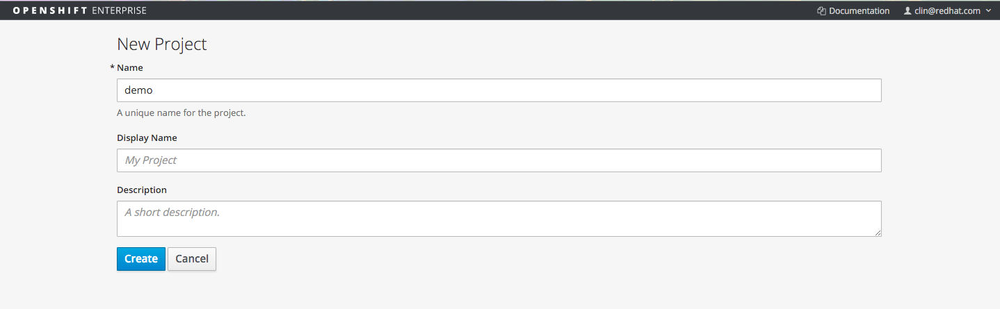
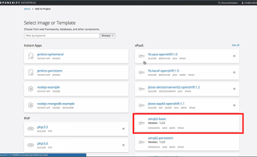
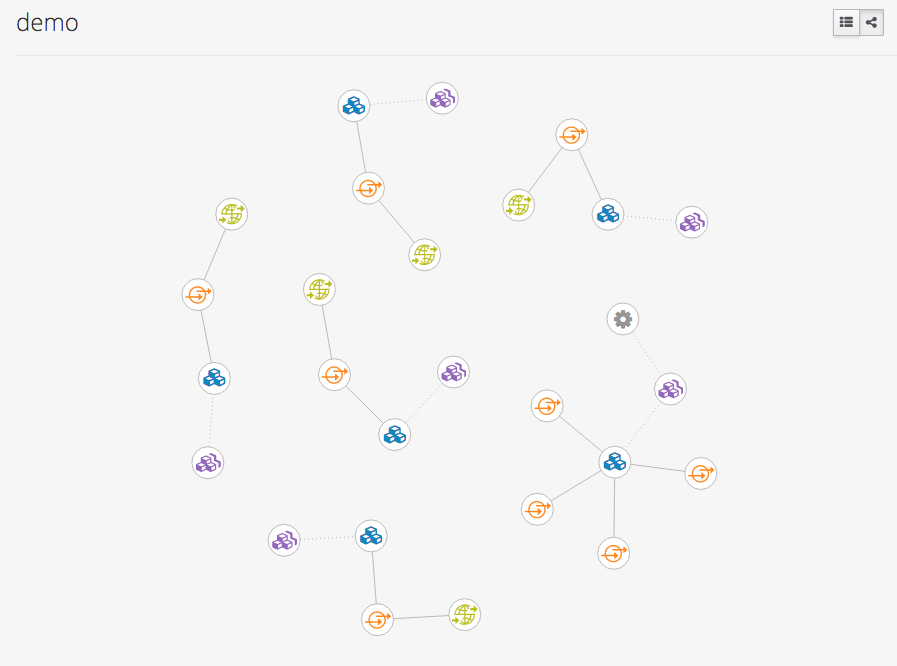
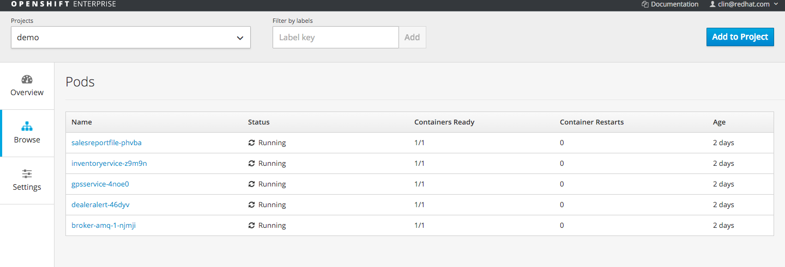

Fuse Integration Service 
=====================================
# Auto Dealership Management System

1. Install OpenShift or have an OpenShift platform 
2. Install OpenShift client
   Instruction to install please go to my blog at:
   http://wei-meilin.blogspot.tw/2016/01/fuse-integration-service-getting-your_19.html

3. Create a project 'demo' in Openshift

	

4. Inside project demo, create amq-basic pod, this will start up an message broker on the PaaS platform.
	 

5. Deploying application using s2i with fabric8 maven plugin, 
	 Before going ahead to deploy application, go to command line console, and make sure the following system environment variable are set. 
	 
	> DOCKER_HOST=tcp://10.1.2.2:2376
	> DOCKER_MACHINE_NAME=YOUR_DOCKER_MACHINENAME
	> DOCKER_TLS_VERIFY=1
	> DOCKER_CERT_PATH=YOUR_CERTPATH

    	 
	 and you have logon to OpenShift using OpenShift client. 
	 > oc login

	 Go to each projects under projects folder
    
 - cardealerdemo-alert
 - cardealerdemo-gps
 - cardealerdemo-inventory
 - cardealerdemo-sales

   and run 
   `mvn -Pf8-local-deploy`

   under each project directories, 
   
6. Login to OpenShift console under https://10.1.2.2:8443/console, you should be able to see all services are up and runing
    
    
   
7. Testing services,
	A. Inventory service, are expose as Restful endpoint, to test it, simply access via a browser with following url
		- Provide inventory status of the vehicle
		http://inventoryservice-demo.cdk.10.1.2.2.xip.io/AutoDMS/getVehicle/vno03
		- Provide inventory status of all vehicle with the price range
		http://inventoryservice-demo.cdk.10.1.2.2.xip.io/AutoDMS/availableVehicle/pricerange/20000/40000
	
	B. Sales service, there is two way to test,
		- Access the restful endpoint with browser, 
			http://salesreportfile-demo.cdk.10.1.2.2.xip.io/AutoDMS/salesTracking
	    - Test with web application (installation instruction please visit:
		    -https://github.com/weimeilin79/jboss-fis-autodealerweb)
		    -http://mydemo-phpdemo.cdk.10.1.2.2.xip.io/sales/sales.html
	  
	  
	  
	C. GPS service -Test with web application (installation instruction please visit:https://github.com/weimeilin79/jboss-fis-autodealerweb)
	 
	  -We will open two pages, one that will feed GPS location data to our service, 
	  http://mydemo-phpdemo.cdk.10.1.2.2.xip.io/gps/startGPSlocation.html
	  -Then we can start receiving the alert from console, 
	 http://mydemo-phpdemo.cdk.10.1.2.2.xip.io/gps/vehiclenearbyconsole.html
	 

		

